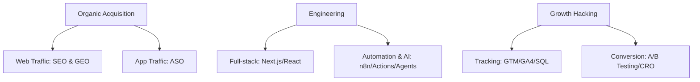

<p align="right">
  <strong>🌐 Language Switcher:</strong>
  <b>🇺🇸 English</b> | 
  <a href="./README_zh.md">🇨🇳 简体中文</a>
</p>

# Hi👋, I'm Chris (mingmingcodes). I Code for Growth.

<p align="center">
  
</p>

## 🚀 Core Positioning & Hybrid Skill Matrix

> **"Using code to scale SEO/GEO, leveraging data to reverse-engineer ASO, and building automation pipelines to power the growth marketing engine."**

---

### 🎯 Hybrid Role Definitions

*   **Growth Engineer**  
    *Translating marketing logic into robust code.* Focused on building full-stack marketing infrastructure, automated data pipelines, in-app event tracking, and scaling programmatic SEO (pSEO) with Python and Node.js.
*   **Growth Hacker**  
    *Data-driven optimizer of the AARRR funnel.* Specializing in rapid A/B testing, user journey mapping, and virality loop design to discover low-cost, high-velocity acquisition channels.
*   **SEO & GEO Lead**  
    *Bridging traditional search and generative AI answer engines.* 
    *   **Technical SEO**: Optimizing site architecture, Core Web Vitals, dynamic rendering, and establishing semantic knowledge graphs using structured JSON-LD data.
    *   **Generative Engine Optimization (GEO)**: Optimizing content architecture and entity density to increase brand citation and recommendation shares in AI Search Engines (e.g., Perplexity, ChatGPT Search, Gemini).
*   **ASO Specialist**  
    *Driving organic mobile app growth.* Focused on App Store and Google Play metadata engineering, keyword mapping, conversion rate optimization (CRO), and competitive intelligence.

---

### 🛠️ Core Skills & MarTech Stack



#### 📊 Growth Technology Classification

| Growth Domain | Core Tactics | Toolbox |
| :--- | :--- | :--- |
| **Technical SEO / GEO** | Programmatic SEO (pSEO), JSON-LD Entity Graph, Semantic SEO, SGE Citing Optimization | Edge-Rendered SSG Framework, Python (BeautifulSoup/Scrapy), Google Search Console, Tech SEO Tools |
| **ASO (Mobile)** | Keyword Mapping, App Metadata Engineering, Localization Strategy, CRO | AppTweak, MobileAction, Google Play Console, App Store Connect |
| **Automation & AI** | Automated Content Pipelines, Keyword Clustering Agents, Auto-Report Workflows | n8n, Make.com, GitHub Actions, OpenAI API, LangChain |
| **Growth Development** | Full-stack Landing Pages, Custom MarTech Widgets, Scraping Scripts, Serverless APIs | Node.js, Python, TypeScript, Tailwind CSS, PostgreSQL, Vercel |
| **Data & CRO** | Advanced Tracking, Funnel Visualization, Event-based Attribution, A/B Testing | Google Tag Manager (GTM), Google Analytics 4 (GA4), Mixpanel, Hotjar, SQL |

---

### ⚙️ Technology & Tools Stack

| Category | Icons / Badges |
| :--- | :--- |
| **Growth & MarTech** |     |
| **Programming** |     |
| **Automation & AI** |    |

---

### ✍️ Latest Experiments & SEO Case Studies
<!-- START_SECTION:waka -->
<!-- Automated workflow placeholder -->
<!-- END_SECTION:waka -->

---

### 🟩 3D Contribution Graph


---

### ⌨️ Contact Terminal

```bash
$ curl -s https://api.mingmingcodes.com/contact | json

{
  "website": "mingmingcodes.com",
  "email": "mingmingcodes@gmail.com",
  "twitter": "@mingmingcodes",
  "timezone": "UTC+8 (Available globally for remote work)"
}
