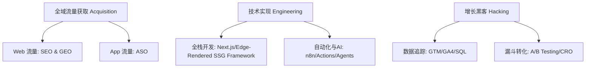
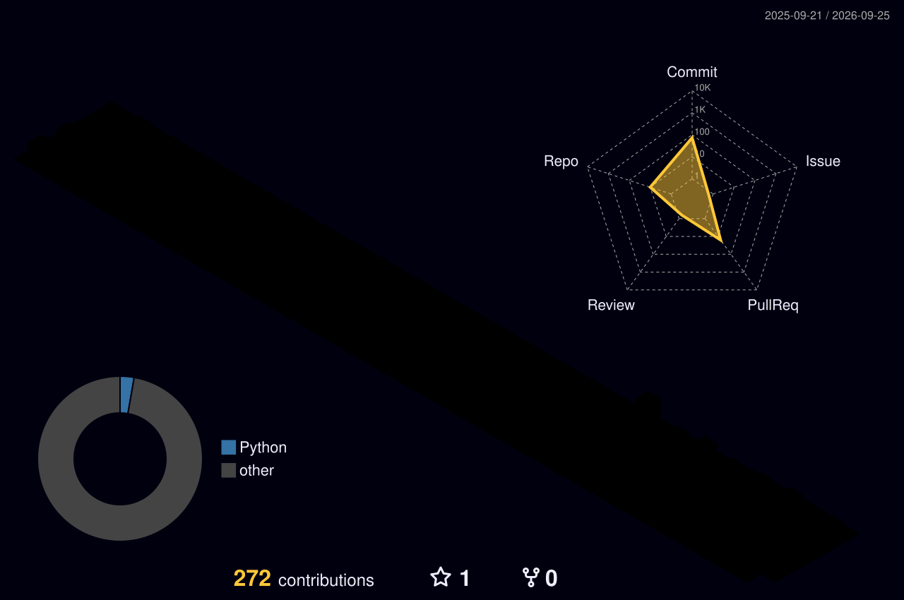

# Hi🖐, Here is mingmingcodes, I'm Chris, I code for Growth.
<p align="center">
      
</p>

## 🚀 核心个人定位与混合技能矩阵 (UVP & Skill Matrix)

> **"Using code to scale SEO/GEO, leveraging data to reverse-engineer ASO, and building automation pipelines to power the growth marketing engine."**  
> *(用代码规模化SEO/GEO，用数据逆向拆解ASO，用自动化工作流驱动增长营销引擎。)*

---

## 🎯 混合职业定位 (Hybrid Role Definitions)

*   **增长工程师 (Growth Engineer)**  
    *将营销（Marketing）逻辑转化为代码实现。* 专注于构建全栈营销基础设施、自动化数据管道（Data Pipelines）、产品内埋点追踪（Tracking & Analytics），以及利用 Python/Node.js 实现规模化内容和流量获取（Programmatic SEO）。
*   **增长黑客 (Growth Hacker)**  
    *数据驱动的 AARRR 漏斗优化专家。* 通过快速的 A/B 测试、用户转化路径分析（Funnel Analysis）、病毒传播机制（Virality Loop）设计，在拉新（Acquisition）和转化（Conversion）环节寻找低成本实现爆发式增长的“技术捷径”。
*   **新一代搜索流量专家 (SEO & GEO Lead)**  
    *打通传统与未来的搜索生态。* 
    *   **基础与技术 SEO (Technical SEO)**：精通网站架构优化、Core Web Vitals 性能榨干、动态渲染以及利用 JSON-LD 结构化数据建立搜索引擎知识图谱。
    *   **生成式引擎优化 (GEO - Generative Engine Optimization)**：**2026年核心前沿技能**。逆向工程 AI 搜索引擎（如 Perplexity, ChatGPT Search, Gemini）的 RAG（检索增强生成）机制，提升品牌在 AI 答复中的提及率与引用权重。
*   **ASO 移动应用商店专家 (ASO Specialist)**  
    *移动端自然增长的控盘者。* 专注于 App Store 与 Google Play 的元数据工程（Metadata Engineering）、关键词矩阵覆盖、转化率优化（CRO）以及利用技术手段进行竞品关键词监控。

---

## 🛠️ 核心技能与 MarTech 武器库 (Core Skills & MarTech Stack)



## 📊 增长技术栈分类明细 (Growth Technology Classification)

| 增长板块 (Growth Domain) | 核心战术与方法论 (Core Tactics)                                                              | 落地支撑技术栈 (Toolbox)                                                           |
| :------------------ | :----------------------------------------------------------------------------------- | :-------------------------------------------------------------------------- |
| **技术SEO / GEO**     | Programmatic SEO (pSEO), Structured Data Entity Graph, Semantic SEO, SGE Citing Optimization | Edge-Rendered SSG Framework, Python (BeautifulSoup/Scrapy), Google Search Console, Screaming Frog |
| **ASO (移动端优化)**     | Keyword Mapping, App Metadata Engineering, Localization Strategy, CRO                | AppTweak, MobileAction, Google Play Console, App Store Connect              |
| **自动化与 AI 增长**      | Automated Content Pipelines, Keyword Clustering Agents, Auto-Report Workflows        | n8n, Make.com, GitHub Actions, OpenAI API, LangChain                        |
| **增长工程开发**          | Full-stack Landing Pages, Custom MarTech Widgets, Scraping Scripts, Serverless APIs  | Node.js, Python, TypeScript, Tailwind CSS, PostgreSQL, Vercel               |
| **数据与转化 (MarTech)** | Advanced Tracking, Funnel Visualization, Event-based Attribution, A/B Testing        | Google Tag Manager (GTM), Google Analytics 4 (GA4), Mixpanel, Hotjar, SQL   |
|                     |                                                                                      |                                                                             |
	

<!-- --- -->
<!-- 📊 实时 GitHub 活跃度与技术栈 (临时隐藏) 
## 📊  实时 GitHub 活跃度与技术栈 (Real-time Developer Metrics)-->

<!--<p align="center">-->
  <!-- 语言卡片：极力推荐保留！它不展示具体的 commit 数量，只展示语言比例。即使你写得少，只要比例对，在视觉上就非常显技术深度。 -->
  <!-- ⚠️ 注意：请将下面链接中的 "你的实际GitHub用户名" 替换为你真实的账户名（例如：growth-jack） -->
 <!-- -->
  
  <!-- 个人活跃卡片：使用国内快速镜像源 (github-readme-stats-fast)，并隐藏了具体的等级（Rank）和一些可能由于新账号而偏低的具体数字，只展示核心价值指标。 -->
  <!-- ⚠️ 注意：请将下面链接中的 "你的实际GitHub用户名" 替换为你真实的账户名 -->
  <!---->
<!--</p>-->


---

## 增长与开发技术栈
### 🛠️ Technology & Tools Stack

| Category | Icons / Badges |
| :--- | :--- |
| **Growth & MarTech** |     |
| **Programming** |     |
| **Automation & AI** |    |

---

## 动态拉取最新 SEO/GEO 研究与博客文章
### ✍️ Latest Experiments & SEO Case Studies
<!-- START_SECTION:waka -->
<!-- 这是自动化脚本注入的占位符，下面会讲如何用 Action 自动拉取你的 Pages 博客文章 -->
<!-- END_SECTION:waka -->

---
## 🟩 三维立体贡献矩阵 (3D Contribution Graph)
 

---
## 命令行联系方式
### ⌨️ Contact Terminal
```bash
$ curl -s https://api.mingmingcodes.com/contact | json

{
  "Website: "mingmingcodes.com",
  "email": "mingmingcodes@gmail.com",
  "twitter": "@mingmingcodes",
  "timezone": "UTC+8 (Available globally for remote work)"
}
