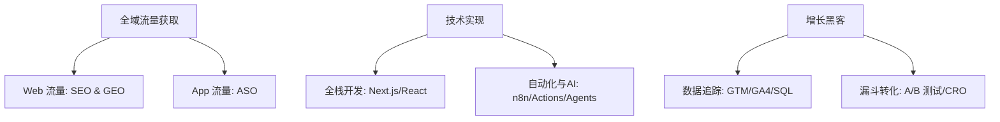
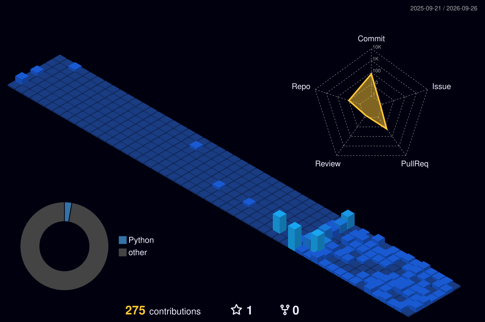

<p align="right">
  <strong>🌐 语言选择:</strong>
  <a href="./README.md">🇺🇸 English</a> | 
  <b>🇨🇳 简体中文</b>
</p>

# 你好👋，我是 Chris (明码)。我用代码驱动业务增长。

<p align="center">
  
</p>

## 🚀 核心个人定位与混合技能矩阵

> **“用代码实现规模化 SEO/GEO，用数据逆向拆解 ASO，构建自动化工作流驱动增长营销引擎。”**

---

### 🎯 混合职业定位

*   **增长工程师 (Growth Engineer)**  
    *将营销逻辑转化为代码实现。* 专注于构建全栈营销基础设施、自动化数据管道（Data Pipelines）、产品内事件埋点追踪，以及利用 Python 和 Node.js 实现规模化内容和流量获取（程序化 SEO - pSEO）。
*   **增长黑客 (Growth Hacker)**  
    *数据驱动的 AARRR 漏斗优化专家。* 专注于快速 A/B 测试、用户转化路径分析、病毒传播机制设计，在拉新（Acquisition）和转化（Conversion）环节寻找低成本实现爆发式增长的技术路径。
*   **新一代搜索流量专家 (SEO & GEO Lead)**  
    *打通传统搜索与未来 AI 生成式检索生态。* 
    *   **技术 SEO (Technical SEO)**：精通网站架构优化、网页核心指标（Core Web Vitals）性能压榨、动态渲染，以及利用 JSON-LD 结构化数据建立搜索引擎知识图谱。
    *   **生成式引擎优化 (GEO)**：针对 AI 搜索引擎（如 Perplexity, ChatGPT Search, Gemini）进行内容架构与实体密度优化，提升品牌在 AI 答复中的提及率与引用权重。
*   **ASO 移动应用商店专家 (ASO Specialist)**  
    *移动端自然增长的控盘者。* 专注于 App Store 与 Google Play 的元数据工程（Metadata Engineering）、关键词矩阵覆盖、转化率优化（CRO）以及利用技术手段进行竞品关键词监控。

---

### 🛠️ 核心技能与 MarTech 武器库



#### 📊 增长技术栈分类明细

| 增长板块 | 核心战术与方法论 | 落地支撑技术栈 |
| :--- | :--- | :--- |
| **技术SEO / GEO** | 程序化 SEO (pSEO), JSON-LD 实体图谱, 语义化 SEO, AI检索引用优化 | 边缘渲染 SSG 框架 (Astro 等), Python (BeautifulSoup/Scrapy), Google Search Console, Screaming Frog |
| **ASO (移动端优化)** | 关键词映射, 应用元数据工程, 本地化策略, 转化率优化 (CRO) | AppTweak, MobileAction, Google Play Console, App Store Connect |
| **自动化与 AI 增长** | 自动化内容生产线, 关键词聚类 AI Agent, 自动化报表工作流 | n8n, Make.com, GitHub Actions, OpenAI API, LangChain |
| **增长工程开发** | 全栈 Landing Page 页面开发, 自定义营销组件, 网页爬虫脚本, 无服务器 API | Node.js, Python, TypeScript, Tailwind CSS, PostgreSQL, Vercel |
| **数据与转化** | 高阶追踪埋点, 转化漏斗可视化, 多触点归因分析, A/B 测试 | Google Tag Manager (GTM), Google Analytics 4 (GA4), Mixpanel, Hotjar, SQL |

---

### ⚙️ 增长与开发技术栈

| 分类 | 核心技术与营销工具徽章 |
| :--- | :--- |
| **增长与 MarTech** |     |
| **编程语言** |     |
| **自动化与 AI** |    |

---

### ✍️ 最新增长实验与 SEO 案例研究
<!-- START_SECTION:waka -->
<!-- 自动化工作流占位符 -->
<!-- END_SECTION:waka -->

---

### 🟩 三维立体贡献矩阵



---

### ⌨️ 命令行联系方式

```bash
$ curl -s https://api.mingmingcodes.com/contact | json

{
  "website": "mingmingcodes.com",
  "email": "mingmingcodes@gmail.com",
  "twitter": "@mingmingcodes",
  "timezone": "UTC+8 (提供全球远程工作支持)"
}
